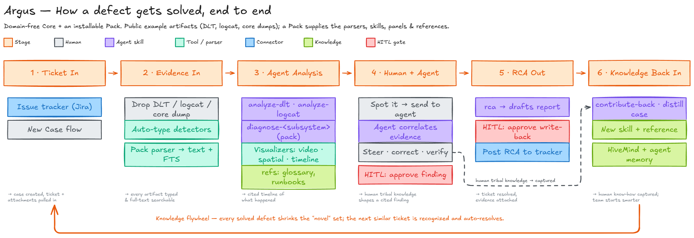
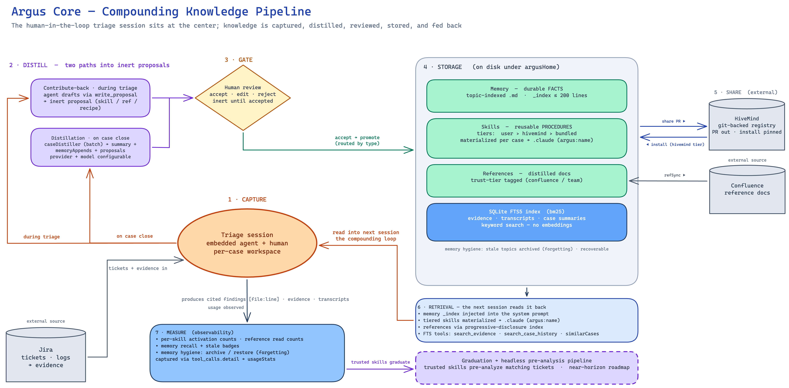

# Argus

**Argus is a local-first, human-in-the-loop workbench for defect triage — and the supervised
training ground for automating it.**

Defect triage is one of the largest hidden time sinks in a software organization, and the
knowledge that makes an engineer fast at it is almost entirely tribal: which log pattern means
what, which release had which regression, which investigation order wastes a day. Fully
automated AI triage fails without that knowledge — and worse than fails: a confidently wrong
analysis posted to a ticket sends it to the wrong team, and every wrong analysis makes
engineers more resistant to AI-assisted triage. Trust, once burned, does not come back.

Argus takes the deliberate middle path. Engineers triage real cases in a desktop workbench
with an embedded agent, and every session **captures knowledge in a machine-usable form**:

- Every claim the agent makes carries a `[file:line]` **citation** — one click verifies it
  against the evidence. Findings are structured records that the engineer accepts or edits,
  never chat scroll.
- The agent **distills session procedures into inert skill proposals**; nothing activates
  until a human reviews and accepts it.
- Accepted skills and reference docs are shared to a team registry (**HiveMind**) as ordinary
  pull requests — reviewed, versioned, installed pinned to a commit.
- Every review action is **measured**: per-skill acceptance rates tell us, with data, which
  skills have earned the right to run unsupervised.

When a skill meets that bar, it graduates to a headless pipeline that pre-analyzes matching
tickets before a human ever opens them — while novel cases keep routing to the workbench,
where the supervised loop continues. The workbench is how the automation earns trust.

## How it works

An Electron app pairs an embedded agent session — [Claude Agent SDK](https://docs.claude.com/en/api/agent-sdk)
by default, four other backends selectable (see [Agent backends](#agent-backends)) — with a
local evidence store and a risk-gated tool-approval model, organized into per-case workspaces
where evidence, findings, chat sessions, and the report live together.



| Pillar | Description |
|---|---|
| **Case-centric UI** | A case is the top-level object; evidence, findings, chat, and the report live under it. Cases are created blank, from a ticket, or by importing a portable case bundle. |
| **Embedded agent** | A headless agent session runs inside the app — the user chats, the agent runs skills and tools, output streams into the UI. Five interchangeable backends are supported, from full-capability to declared-degraded (see [Agent backends](#agent-backends)). |
| **Evidence library** | Local artifacts per case, auto-typed by pack detectors, auto-extracted from binary formats into searchable text, indexed with SQLite FTS5 across evidence, findings, and transcripts. |
| **Cited findings** | Agent claims require `[file:line]` citations; findings carry a pending → reviewed state and every citation opens the evidence at the exact line. |
| **HITL risk gating** | Every tool call is classified LOW/MEDIUM/HIGH. Reads auto-run and are logged; write-backs show an editable preview card; destructive operations require explicit confirmation and are never batched. |
| **Compounding knowledge** | Topic-indexed agent memory, session-distilled skill proposals, tiered skills (user > hivemind > bundled), and reference docs distilled from external sources — all human-reviewed before they take effect. Skills, memory, and references live together in a **Knowledge hub**; proposals get their own review page (pending-count badge, accept/edit/reject with an optional reason) that feeds back into what the distiller produces next. Distillation runs headless on a provider and model you choose independently of the chat session, and reference docs are re-synced against upstream, offering to prune pages that have vanished. |
| **Pack panels** | Packs ship sandboxed web UI (strict CSP, capability-scoped bridge) docked inside the case; the agent can open panels and capture what they show as evidence. |
| **Code workspaces** | A case can link checked-out repositories; the agent gets sandboxed `git`/`gh` access with worktree isolation. |
| **Modes & review mode** | Every case runs in a mode — **triage** by default. Linking a GitHub PR (by URL, `owner/repo#N`, a bare number, or automatic discovery against linked repos) unlocks **review mode**: a PR-scoped worktree materializes, the persona and ranked skill set switch to code-review, and the mode switcher in the case header follows you to that mode's chat. |
| **Observability** | Local SQLite metrics: cost, tokens, latency, approvals, cost-per-resolved-case — the instrument for proving (or disproving) the efficiency claim. Optional OpenTelemetry export to a self-hosted Langfuse (each case maps to a trace session), off by default. |

## Agent backends

The embedded agent runs behind a **driver** abstraction, so the same case UI, risk gating,
native tools, findings, memory, and skills work over any backend. More than one provider
can be enabled at a time (Settings → Agent): the chat model picker aggregates models across
every enabled provider, and **the model you pick is what selects the provider** for that
session. The configured default provider only decides which backend handles background work
that has no picker (distillation, reference sync).

| Driver | Auth | Notes |
|---|---|---|
| **Claude Agent SDK** (default) | Claude CLI login | Full capability set: editable approval cards, per-turn USD cost, the full model catalog. |
| **GitHub Copilot** | `gh` CLI login (`gh auth login`) or a `COPILOT_GITHUB_TOKEN` env var | Requires a GitHub Copilot subscription — the **free tier works**. Ships inside the `@github/copilot-sdk` npm dependency; runs against an isolated `COPILOT_HOME`. |
| **OpenAI Codex** | Global `~/.codex` auth (or an overridden `CODEX_HOME`) | JSON-RPC app-server driver; supports headless runs (distillation). |
| **Cursor** / **Grok** | Local `cursor-agent` / `grok` CLI | Both run over the same Agent Client Protocol (ACP) driver. |

**Declared limitations** (surfaced honestly in the UI, not hidden — every non-default driver
gives up something):

- **Copilot**: approval cards are approve/deny only (no inline edit); cost shows "n/a" instead
  of a fake `$0.00`; free tier exposes only the `auto` model router.
- **Codex**: same approve/deny-only and no-cost limits as Copilot; subagents are inlined into
  the main turn rather than registered separately.
- **Cursor / Grok (ACP)**: no editable approvals or cost; no headless runs; and a known gap —
  the ACP protocol carries no system prompt field, so persona, citation rules, and the skill/
  memory index don't reach the model on these two drivers today.

Plan mode and the full LOW/MEDIUM/HIGH risk gating work across all five drivers.

## Packs: Core is domain-free

Core knows nothing about any specific file format, tool, or workflow. All domain capability
arrives through **installable packs**: a pack declares its persona fragment, native binaries,
evidence detectors, skills, reference docs, and UI panels in an `argus-pack.json` manifest,
and Core discovers them at startup. A vendor or team can teach Argus their domain without
forking Core — and the same pack components (detectors, binaries, skills) are what the
headless pipeline reuses once they graduate.

See [docs/authoring-packs.md](docs/authoring-packs.md) for the pack contract, and the
`packs/` directory for runnable samples.

## Known-defect sources

Argus can consume external **Defect Corpus** services — read-only HTTP APIs that serve a
team's distilled history of past defects — as another input to triage, alongside evidence
and memory. Sources are configured per team, on Settings → Team, each as a base URL plus a
bearer token; the token lives in the OS secret store, never in the settings file and never
crossing IPC as plaintext. A match surfaces in three places: the case-open workbench's
"Known defects" card, the agent's own `search_known_defects` tool (a plain read, so it runs
without an approval prompt), and admin-only sync controls for teams whose token can trigger
one. A corpus that is unreachable or misconfigured never blocks or degrades triage — it
fails silent, rendering as an empty section with no error surfaced mid-session.

## The trust model, in one paragraph

Evidence is third-party content, and it flows into an agent with tool access — so nothing
interpretive leaves the loop unreviewed. Reads are auto-approved and logged; anything that
writes (a ticket comment, a memory, a git push) stops at an editable preview; anything
destructive requires explicit confirmation. Skills activate only after human acceptance,
shared knowledge moves only by pull request, and analysis is only as credible as the
citations it carries. Automation is graduated, never assumed.



## Repository layout

| Path | What it is |
|---|---|
| `app/` | Electron app (electron-vite, React 19, TypeScript, Tailwind 4, `node:sqlite`) |
| `packs/` | Bundled and sample packs (minimal webPanel, bridge playground, external app, code-graph) |
| `tools/pack-tools/` | `argus-pack` build/packaging CLI for pack authors |
| `docs/` | Pack authoring contract and developer docs |

## Running

```bash
cd app
npm install
npm run dev
```

Requires Node.js 22.13+ and at least one agent backend available: the Claude Code CLI installed
and logged in, or GitHub Copilot via `gh auth login` (see [Agent backends](#agent-backends)).

## Status

Argus is in active development and currently in its supervised-capture phase: single-team
pilot, desktop-only, with the headless graduation pipeline on the roadmap. Expect sharp edges.

## License

See [LICENSE](LICENSE).
